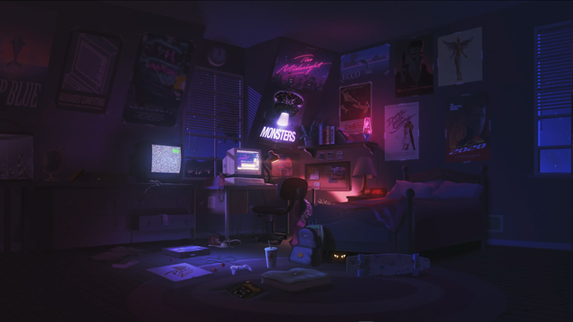

<h1 align="center">Hello there! , my name is Glenn Mendonca.</h1>
<h3 align="center">Currently a bachelor pursuing a degree in Computer Engineering.</h3>

- 🔭 I’m currently working on **My Webpage, React dynamic site.**

- 🌱 I’m currently learning **React, JavaScript, Java.**

- 👯 I’m looking to collaborate on **Python**

- 🤝 I’m looking for help with **getting started with open source.**

- 👨‍💻 All of my projects are available at [https://github.com/Glenn-Mendonca](https://github.com/Glenn-Mendonca)

- 💬 Ask me about **Python**

- 😄 Pronouns: **He/ Him**

- 📫 How to reach me **glenm.code@gmail.com**

<h3 align="left">Connect with me:</h3>

<h3 align="left">Languages and Tools:</h3>

  
  
  
  
  
  

&nbsp;

